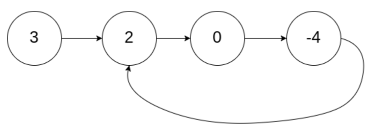

# 141. Linked List Cycle

`Hash Table`, `Linked List`, `Two Pointers`

## Problem

Given `head`, the head of a linked list, determine if the linked list has a cycle in it.

There is a cycle in a linked list if there is some node in the list that can be reached again by continuously following the next pointer. Internally, `pos` is used to denote the index of the node that tail's `next` pointer is connected to. **Note that `pos` is not passed as a parameter**.

Return `true` *if there is a cycle in the linked list*. Otherwise, return `false`.

### Example

```
Input: head = [3,2,0,-4], pos = 1
Output: true
Explanation: There is a cycle in the linked list, where the tail connects to the 1st node (0-indexed).
```


```
Input: nums = [1], target = -1
Output: false
```

### Constraints
* The number of the nodes in the list is in the range `[0, 10^4]`.
* `-10^5 <= Node.val <= 10^5`
* `pos` is -1 or a **valid index** in the linked-list.
---

## Idea

### 1. Linked List Traversal (Brute-force)

記錄下所有已經拜訪過的 node，如果現在拜訪的 node.next 已存在在拜訪過的 node 中，則有 cycle。

* **Note:**
    * `visited` 用 set 或 list 都可以，但判斷元素是否在其中 (in) 的搜索方法，**set 會比 list 快很多**。

```python
# Definition for singly-linked list.
# class ListNode(object):
#     def __init__(self, x):
#         self.val = x
#         self.next = None

class Solution(object):
    def hasCycle(self, head):
        """
        :type head: ListNode
        :rtype: bool
        """
        visited = set()
        while head is not None:
            if head in visited:
                return True
            visited.add(head)
            head = head.next
        return False
```
* Time complexity: $O(n)$
    * Traverse the linked list only once.
    * Python set lookup takes $O(1)$ on average.
* Space complexity: $O(n)$
    * Use a `set` to record the visited nodes.


### 2. Cycle Detection via Slow-Fast Pointers

用兩個 pointer，一個走得快一個走得慢，如果有 cycle 存在，快的有一天會追上慢的。

```python
# Definition for singly-linked list.
# class ListNode(object):
#     def __init__(self, x):
#         self.val = x
#         self.next = None

class Solution(object):
    def hasCycle(self, head):
        """
        :type head: ListNode
        :rtype: bool
        """
        if head is None:
            return False
        fast = head
        slow = head
        while fast.next and fast.next.next:
            fast = fast.next.next
            slow = slow.next
            if fast == slow:
                return True
        return False
```
* Time complexity: $O(n)$
* Space complexity: $O(1)$
