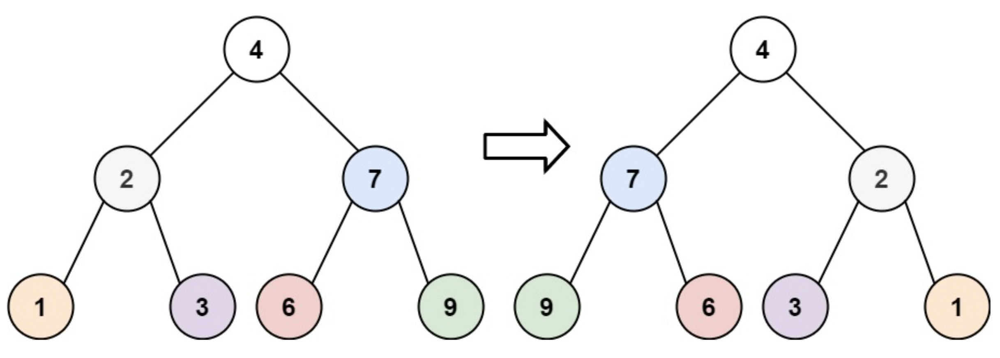

# 226. Invert Binary Tree

`Tree`, `Depth-First Search`, `Breadth-First Search`, `Binary Tree`

## Problem

Given the `root` of a binary tree, invert the tree, and return its *root*.

### Example



```
Input: root = [4,2,7,1,3,6,9]
Output: [4,7,2,9,6,3,1]
```

### Constraints
* The number of nodes in the tree is in the range `[0, 100]`.
* `-100 <= Node.val <= 100`

---

## Idea

### 1. Recursive - DFS

由 root 的左右還有其分支，逐步去做 inverse。

且當前 root 的 left and right 也分別是 subtree，故可以使用 recursive 的方式進行。

```python
# Definition for a binary tree node.
# class TreeNode(object):
#     def __init__(self, val=0, left=None, right=None):
#         self.val = val
#         self.left = left
#         self.right = right
class Solution(object):
    def invertTree(self, root):
        """
        :type root: Optional[TreeNode]
        :rtype: Optional[TreeNode]
        """
        if not root:
            return None
        left = self.invertTree(root.right)
        right = self.invertTree(root.left)
        root.left = left
        root.right = right
        return root
```
* Time complexity: $O(n)$
* Space complexity: $O(h)$, where $h$ is the height of the binary tree.
    * 最糟的情況就是 node 都集中在同一側，那 tree 的深度就剛好為 $n$，空間複雜度為 $O(n)$。