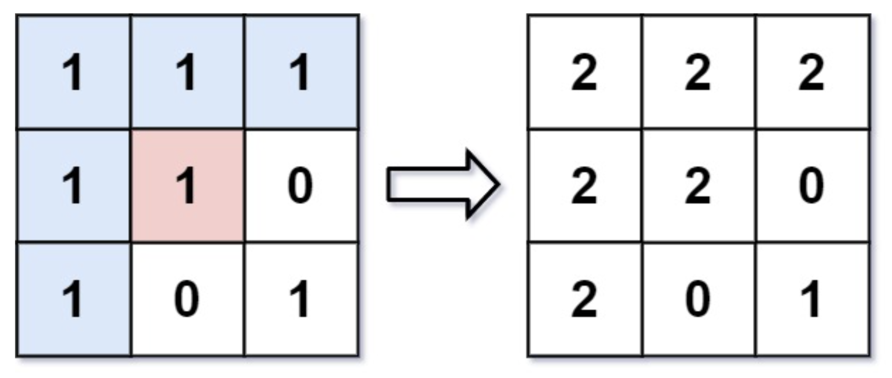

# 733. Flood Fill

`Array`, `BFS`, `DFS`, `Matrix`

## Problem

You are given an image represented by an `m x n` grid of integers `image`, where `image[i][j]` represents the pixel value of the image. You are also given three integers `sr`, `sc`, and `color`. Your task is to perform a **flood fill** on the image starting from the pixel `image[sr][sc]`.

To perform a **flood fill**:

1. Begin with the starting pixel and change its color to `color`.
2. Perform the same process for each pixel that is **directly adjacent** (pixels that share a side with the original pixel, either horizontally or vertically) and shares the **same color** as the starting pixel.
3. Keep **repeating** this process by checking neighboring pixels of the *updated* pixels and modifying their color if it matches the original color of the starting pixel.
4. The process **stops** when there are **no more** adjacent pixels of the original color to update.

Return the **modified** image after performing the flood fill.

### Example

```
Input: image = [[1,1,1],[1,1,0],[1,0,1]], sr = 1, sc = 1, color = 2

Output: [[2,2,2],[2,2,0],[2,0,1]]
```


```
Input: image = [[0,0,0],[0,0,0]], sr = 0, sc = 0, color = 0

Output: [[0,0,0],[0,0,0]]

Explanation:

The starting pixel is already colored with 0, which is the same as the target color. Therefore, no changes are made to the image.
```

### Constraints
* `m == image.length`
* `n == image[i].length`
* `1 <= m, n <= 50`
* `0 <= image[i][j], color < 2^16`
* `0 <= sr < m`
* `0 <= sc < n`

---

## Idea

### 1. Depth-First Search

1. 先判斷初始點的顏色和 `color` 是否相同。若相同就不用做了，直接回傳 `image`；若顏色不同就進行換色和向上下左右拓展 (`dfs`)。

2. 檢查是否超出邊界與顏色是否符合換色資格。滿足條件後換色，並已遞迴的方式在繼續進行上下左右的拓展。

```python
class Solution(object):
    def floodFill(self, image, sr, sc, color):
        """
        :type image: List[List[int]]
        :type sr: int
        :type sc: int
        :type color: int
        :rtype: List[List[int]]
        """
        if image[sr][sc] == color:
            return image

        old_c = image[sr][sc]
        self.dfs(image, sr, sc, old_c, color)

        return image
        
    def dfs(self, img, row, col, old_color, color):
        if(0<=row<len(img) and 0<=col<len(img[0]) and img[row][col]==old_color):
            img[row][col] = color
            self.dfs(img, row, col+1, old_color, color) # move right
            self.dfs(img, row, col-1, old_color, color) # move left
            self.dfs(img, row-1, col, old_color, color) # move up
            self.dfs(img, row+1, col, old_color, color) # move down
```
* Time complexity: $O(mn)$
* Space complexity: $O(1)$


### 2. Breadth-First Search

1. 用 `queue` 輔助演算法進行，`queue` 中存入需要拓展的位點位，以 while loop 反覆進行換色，直到 `queue` 為空。

2. 每當目前的點位換色後，需要判斷上下左右的點是否符合條件(在邊界內、顏色)，只將符合條件者放入 `queue` 中。

```python
class Solution(object):
    def floodFill(self, image, sr, sc, color):
        """
        :type image: List[List[int]]
        :type sr: int
        :type sc: int
        :type color: int
        :rtype: List[List[int]]
        """
        if image[sr][sc] == color:
            return image

        old_c = image[sr][sc]
        q = deque()
        q.append((sr, sc))
        adj_cells = [
            [0,  1], # move right
            [0, -1], # move left
            [-1, 0], # move up
            [1,  0], # move down
        ]
        
        while(q):
            row, col = q.popleft()
            image[row][col] = color

            for cell in adj_cells:
                r = row + cell[0]
                c = col + cell[1]
                if(0<=r<len(image) and 0<=c<len(image[0]) and image[r][c]==old_c):
                    q.append((r, c))

        return image
```
* Time complexity: $O(mn)$
* Space complexity: $O(mn)$
    * $O(mn)$ 應該是 queue 的儲存空間
