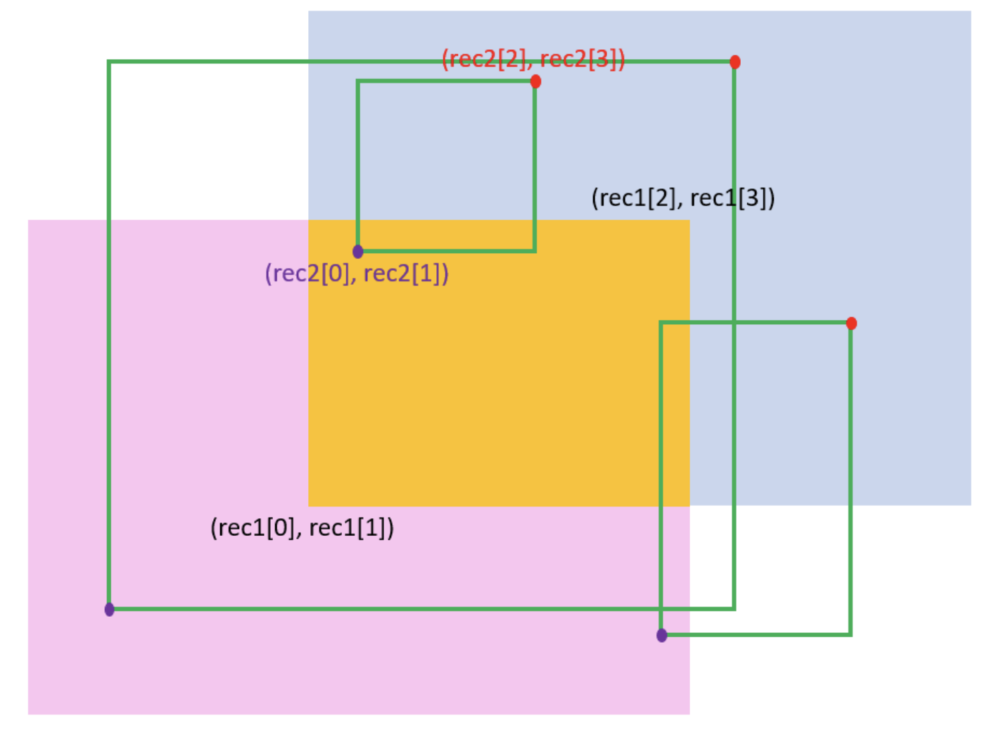

# 836. Rectangle Overlap

`Math`, `Geometry`

## Problem

An axis-aligned rectangle is represented as a list `[x1, y1, x2, y2]`, where `(x1, y1)` is the coordinate of its bottom-left corner, and `(x2, y2)` is the coordinate of its top-right corner. Its top and bottom edges are parallel to the X-axis, and its left and right edges are parallel to the Y-axis.

Two rectangles overlap if the area of their intersection is **positive**. To be clear, two rectangles that only touch at the corner or edges do not overlap.

Given two axis-aligned rectangles `rec1` and `rec2`, return `true` *if they overlap, otherwise return* `false`.

* 用左下角和右上角這兩個點判斷兩個長方形有無重疊 (邊相貼不算)

### Example

```
Input: rec1 = [0,0,2,2], rec2 = [1,1,3,3]
Output: true
```

```
Input: rec1 = [0,0,1,1], rec2 = [1,0,2,1]
Output: false
```

### Constraints
* `rec1.length == 4`
* `rec2.length == 4`
* `-10^9 <= rec1[i], rec2[i] <= 10^9`
* `rec1` and `rec2` represent a valid rectangle with a non-zero area.

---

## Idea

### 1. Intuition



* rec2 的右上角要落在藍色+黃色的範圍 **且** rec2 的左下角要落在粉色+黃色的範圍。

```python
class Solution(object):
    def isRectangleOverlap(self, rec1, rec2):
        """
        :type rec1: List[int]
        :type rec2: List[int]
        :rtype: bool
        """
        return (rec2[0]<rec1[2] and rec2[1]<rec1[3]) and (rec2[2]>rec1[0] and rec2[3]>rec1[1])
```
* Time complexity: $O(1)$
* Space complexity: $O(1)$